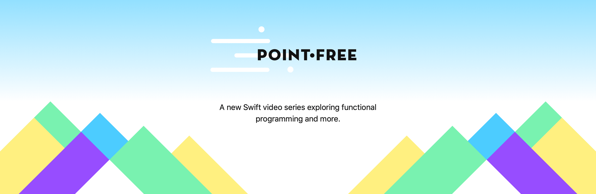

[](https://codecov.io/gh/marcosgriselli/Sizes)


Sizes reduces the time it takes to evaluate all of our apps possible device sizes, orientations and font combinations. With Sizes we'll avoid launching all the supported devices simulator, running our app and navigating through each screen manually which not only takes a lot of time but its also highly error prone since we sometimes forget to test one particular combination and we ship a screen with a layout bug to the App Store.

## ⚠️ Sizes deprecation recommendation

Xcode 11 introduced Previews which is a fantastic way to quickly validate your UI in multiple scenarios just like Sizes did. If you'd like to know more about Xcode Previews I recommend [this WWDC session](https://developer.apple.com/videos/play/wwdc2019/233/). You can even use [Previews with UIKit](https://nshipster.com/swiftui-previews/) so there's no reason to stick to this library.

This library will be deprecated and the repo will be archived in the future.

## 📱 Sizes in action


*Recorded on an 10.5 inch iPad Pro*

[](https://www.pointfree.co)

Sizes was created as a port of [Brandon Williams](https://twitter.com/mbrandonw) and [Stephen Celis](https://twitter.com/stephencelis) in Playgrounds for the [Kickstarter iOS app](https://github.com/kickstarter/ios-oss) and further explained in [PointFree](https://www.pointfree.co) to iOS. Make sure to check their site out! 

## 🌟 Features

- [x] Inspect your app in multiple device sizes
- [x] Switch orientations
- [x] Test all font sizes
- [x] Universal (iPhone & iPad)

### 💡 Demo

To run the demo project, clone the repo and run `Sizes` target.

## 📲 Installation

#### Using [CocoaPods](https://cocoapods.org)

Edit your `Podfile` and specify the dependency:

```ruby
pod 'Sizes'
```

#### Using [Carthage](https://github.com/carthage)

Edit your `Cartfile` and specify the dependency:

```bash
github "marcosgriselli/Sizes"
```

## 👩‍💻 How to use

### Preparations

Sizes require you to use [Auto Layout]((https://developer.apple.com/library/archive/documentation/UserExperience/Conceptual/AutolayoutPG/)) in order to update the UI correctly with each change.

For font updates you'll need to use [Dynamic Type](https://developer.apple.com/design/human-interface-guidelines/ios/visual-design/typography/).

**Programmatically:**

```swift 
let label = UILabel()
label.font = UIFont.preferredFont(forTextStyle: .headline, compatibleWith: traitCollection)
label.adjustsFontForContentSizeCategory = true
```

**IB/Storyboard:**


### Setup

I highly recommend you only use this while on `#DEBUG` mode.

The best way to setup Sizes is to use the `SizesWindow` as your `AppDelegates'` window. This will automatically make a `SizesViewController` instance contain your apps root view controller and you'll still be able to use code like `UIApplication.shared.windows.first?.rootViewController as? YourInitialCustomViewController` with no issues. 

```swift
func application(_ application: UIApplication, didFinishLaunchingWithOptions launchOptions: [UIApplication.LaunchOptionsKey: Any]?) -> Bool {
    #if DEBUG
        window = SizesWindow()
        window?.rootViewController = UIStoryboard(name: "Main", bundle: nil).instantiateInitialViewController()!
        window?.makeKeyAndVisible()
    #endif
    return true
}
```

### Usage

Shake to display the Sizes configuration UI, then tap on one of the orientation/device options to trigger a change. Or update the Text size slider to navigate through the different font sizes, you'll get the font name as you slide. You can check a longer video implementation and some of the use cases of Sizes in [this tweet](https://twitter.com/marcosgriselli/status/1038459645596250114)


## 🛣 Roadmap

You can check the GitHub [Project](https://github.com/marcosgriselli/Sizes/projects/1) or [Issues](https://github.com/marcosgriselli/Sizes/issues) to get an overview of new features, fixes or releases planed. 

## ❤️ Contributing
This is an open source project, so feel free to contribute. How?
- Open an [issue](https://github.com/marcosgriselli/Sizes/issues/new).
- Send feedback via [twitter](https://twitter.com/marcosgriselli).
- Propose your own fixes, suggestions and open a pull request with the changes.

See [all contributors](https://github.com/marcosgriselli/Sizes/graphs/contributors)

## 📣 Mentions

- [iOS Goodies #250](https://ios-goodies.com/post/178728323086/week-250)
- [AppCoda Weekly](http://digest.appcoda.com/issues/appcoda-weekly-issue-92-137765)
- [iOS Dev Weekly](https://iosdevweekly.com/issues/373#tools) 
- [Swift Weekly](http://digest.swiftweekly.com/issues/swift-weekly-issue-133-138916)
- [Indie iOS Focus Weekly](https://indieiosfocus.com/issues/196)

## 👨‍💻 Author
Marcos Griselli | <a href="url"></a> [@marcosgriselli](https://twitter.com/marcosgriselli)

[](https://twitter.com/marcosgriselli)

[](https://github.com/marcosgriselli)

## 🛡 License

```
MIT License

Copyright (c) 2018 Marcos Griselli

Permission is hereby granted, free of charge, to any person obtaining a copy
of this software and associated documentation files (the "Software"), to deal
in the Software without restriction, including without limitation the rights
to use, copy, modify, merge, publish, distribute, sublicense, and/or sell
copies of the Software, and to permit persons to whom the Software is
furnished to do so, subject to the following conditions:

The above copyright notice and this permission notice shall be included in all
copies or substantial portions of the Software.

THE SOFTWARE IS PROVIDED "AS IS", WITHOUT WARRANTY OF ANY KIND, EXPRESS OR
IMPLIED, INCLUDING BUT NOT LIMITED TO THE WARRANTIES OF MERCHANTABILITY,
FITNESS FOR A PARTICULAR PURPOSE AND NONINFRINGEMENT. IN NO EVENT SHALL THE
AUTHORS OR COPYRIGHT HOLDERS BE LIABLE FOR ANY CLAIM, DAMAGES OR OTHER
LIABILITY, WHETHER IN AN ACTION OF CONTRACT, TORT OR OTHERWISE, ARISING FROM,
OUT OF OR IN CONNECTION WITH THE SOFTWARE OR THE USE OR OTHER DEALINGS IN THE
SOFTWARE.
```
